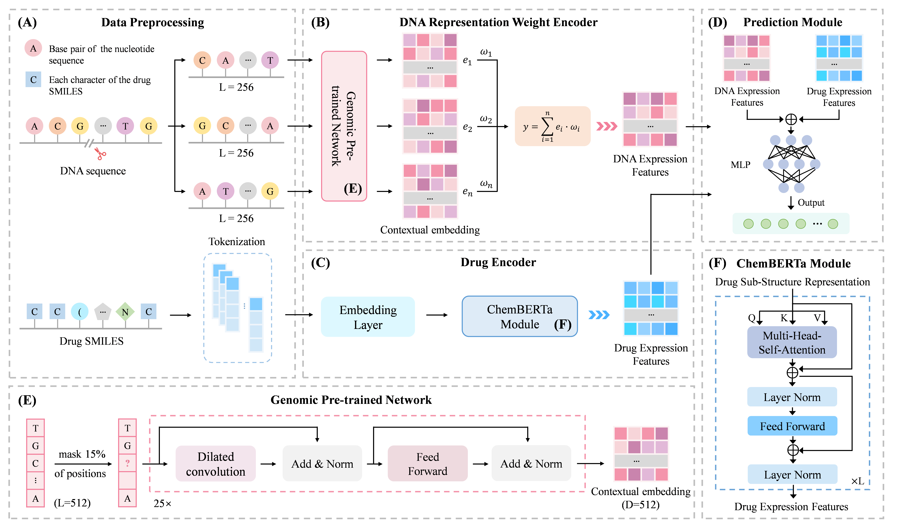

# LLMDGA

## Predicting Drug-Gene Associations via Large Language Model and Representation Weight Encode

This repository provides the official implementation of LLMDGA, including:

- Training and testing datasets (including the full dataset, 5-fold cross-validation datasets, and an independent test set)
- Training and inference code for AlignNet
- Weights of the LLM pre-trained models used in the model (Genomic Pre-trained Network and ChemBerta)

## Table of Contents

- [Overview of LLMDGA](#overview-of-llmdga)
- [Installation](#installation)

## Overview of LLMDGA

LLMDGA is a framework which integrates LLM-driven pre-trained models for gene and drug feature modeling. It consists of three steps for predicting drug-gene associations. 

- **Data Preprocessing:** The whole-genome sequence is divided into fixed-length subsequence windows, and the drug SMILES strings are tokenized into multiple substructures. 
- **Learning Embeddings via LLM-based Pre-trained Models:** Contextual embeddings for both the genome and the drug are learned using GPN and ChemBERTa, respectively. The final gene features are obtained by performing a representation weight encode of the subsequence embeddings. 
- **Drug-Gene Association Preference Scoring:** Predict drug-gene association preferences based on the learned embeddings.



> Flowchart of the LLMDGA Framework: (A) Data Preprocessing: The whole-genome sequence is divided into fixed-length, consecutive subsequences, and the drug SMILES strings are tokenized into multiple substructures. (B) DNA Representation Weight Encoder: Each subsequence is input into the pre-trained GPN model. The resulting contextual embeddings are aggregated through weighted averaging to generate the DNA Expression Features for the entire genome. (C) Drug Encoder: The tokenized drug SMILES strings are encoded by ChemBERTa to obtain the Drug Expression Features. (D) Prediction Module: The learned embeddings for genes and drugs are passed to a multilayer perceptron (MLP) regressor to predict binding affinity. (E) Genomic Pre-trained Network: The GPN model combines CNNs and self-supervised masked language modeling for pre-training on DNA sequences. (F) ChemBERTa Module: ChemBERTa uses Transformer architecture and self-supervised pre-training to learn transferable chemical molecular representations.

## Installation

Create and activate the conda environment:

```bash
conda env create -f LLMDGA.yaml
conda activate AlignNet
```

## Dataset Preparation

The complete dataset is available in the `data` folder, including:

- **GDI.csv:** The complete drug-gene dataset, sourced from DGIdb 5.0
- **GDI_train_0-5.csv:** The five-fold cross-validation training set
- **GDI_test_0-5.csv:** The five-fold cross-validation test set
- **GDI_indepent.csv:** The independent set

## Weights of Pre-trained LLM Models

The pre-trained LLM models used by LLMDGA—Genomic Pre-trained Network (GPN) and ChemBERTa—are provided in the `LLM` folder.

To use GPN and ChemBerta and load pre-trained weights

```python
gene_language_model_file = root_path + "/LLM/GPN"
drug_language_model_file = root_path + "/LLM/ChemBERTa-77M-MLM/"

gene_language_model = AutoModel.from_pretrained(gene_language_model_file).cuda()
drug_language_model = RobertaModel.from_pretrained(drug_language_model_file).cuda()
```

**Note:**

You may encounter an error:

```
ValueError: The checkpoint you are trying to load has model type ConvNet but Transformers does not recognize this architecture. This could be because of an issue with the checkpoint, or because your version of Transformers is out of date.
```

This may be because the ConvNet used by GPN is not one of the built-in architectures in Transformers. To resolve this issue, please clone the [GPN repository](https://github.com/songlab-cal/gpn).

```bash
mkdir gpn
cd gpn
git clone https://github.com/songlab-cal/gpn
```

## Training & Inference

To train the LLMDGA model:

```bash
CUDA_VISIBLE_DEVICES=0 nohup python -u main.py --save_model True > log/train.log 2>&1 &
```

You can customize the following parameters:

```bash
CUDA_VISIBLE_DEVICES=0 nohup python -u main.py \
    --epochs 20 \
    --batch_size 1 \
    --learn_rate 1e-5 \
    --hidden_size 512 \
    --seq_seg_len 64 \
    --seq_token_len 512 \
    --save_model True \
    --load_model False > log/train.log 2>&1 &
```

## Acknowledgements

This project builds upon state-of-the-art architectures including [GPN](https://github.com/songlab-cal/gpn) and [ChemBERTa](https://github.com/deepforestsci/chemberta3). We gratefully acknowledge the contributions from the respective developers and the research community that made these advancements possible.